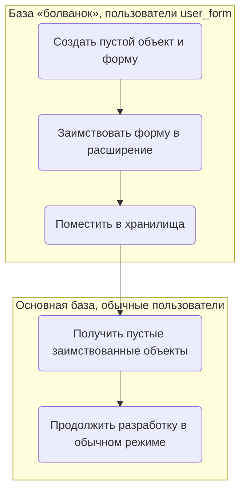
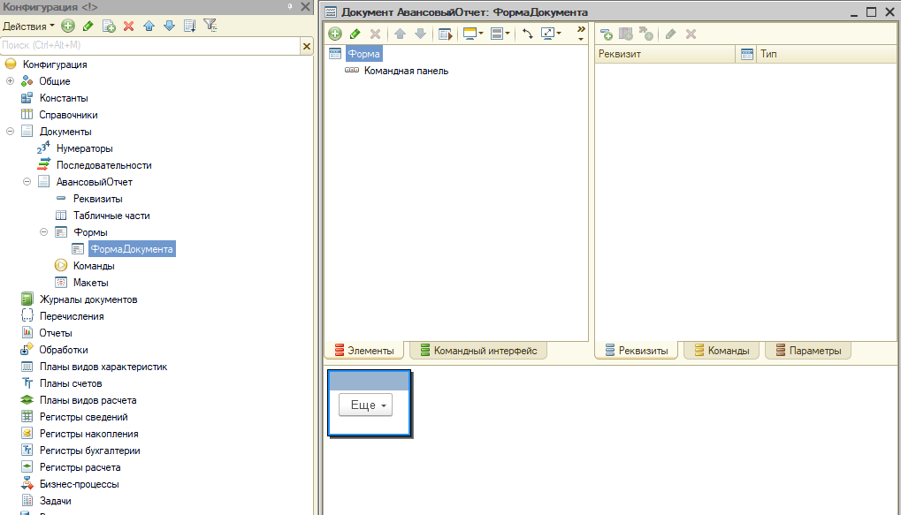
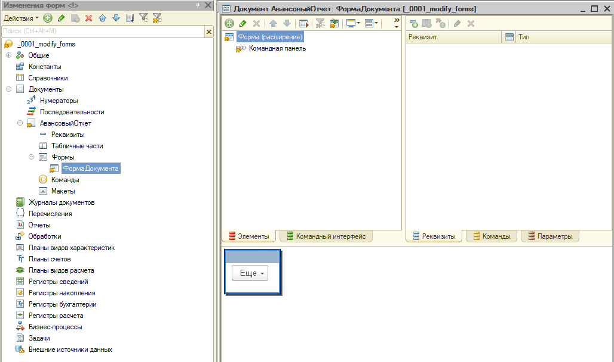

# Модификация форм расширениями

[Все статьи](./README.md)

Порядок работы, на который ссылается правило [14.4](../standart/14_extensions.md#144-формы).

## Цель

Снизить риски при изменении форм основной конфигурации расширениями.

## Проблема

При запуске платформа объединяет основную конфигурацию и изменения заимствованных объектов в расширениях. При объединении структур форм — **особенно** если одну форму меняют **несколько** расширений — возникают «плавающие» ошибки: форма ведёт себя непредсказуемо, появляются инциденты, которые трудно воспроизвести.

## Решение

- Заимствованные формы **пустые**: в них нет ни одного заимствованного или добавленного в редакторе реквизита или элемента.
- Все изменения формы делаются **только кодом** в модуле формы расширения.

Что это даёт, кроме защиты от ошибок объединения:

- все изменения формы явно записаны в коде и видны при ревью (изменения, сделанные мышкой в редакторе формы, неочевидны);
- платформе не нужно анализировать и объединять структуры форм при их создании.

Минус — разработка дольше: «накликать» элементы в редакторе быстрее, чем написать код.

## Как это сделать технически

Первичное заимствование формы выполняется в **пустой** конфигурации. Дальше работа с заимствованной формой идёт в основной конфигурации, и на форму **никогда** не добавляются реквизиты и элементы в редакторе — только программно.

Исходно есть основная конфигурация и расширение, подключённые к своим хранилищам (например, `stor_conf` и `stor_ext`).

### Подготовка

> ❗ В свойствах расширения **обязательно** выключается опция «Поддерживать соответствие объектам расширяемой конфигурации по внутренним идентификаторам». На практике лучше снять все изменяемые флажки у корня расширения.

1. Создать хранилище `stor_forms_ext` с пустой конфигурацией. В нём будут пустые «болванки» объектов для заимствования.

   > Если при первом импорте расширения появится ошибка «Значение контролируемого свойства ОбъектРасширяемойКонфигурации у объекта Язык.Русский не совпадает со значением в расширяемой конфигурации», в гиперссылке «Действие — Исправить» выберите «Сохранить имя, изменив соответствие».

2. В хранилище расширения завести дополнительных пользователей вида `user_form` — по одному на каждого разработчика.

### Процесс

**В базе «болванок»** (пользователи хранилищ вида `user_form`):

1. Создать объект с тем же именем, что в основной конфигурации.

   > ❗ Форму создавать **произвольной**, чтобы платформа не добавила автоматически реквизит со ссылкой на объект. Форма должна быть **абсолютно пустой**.

2. Заимствовать созданное в расширение.
3. Поместить изменения в хранилища пустой конфигурации и расширения.

**В основной базе** (обычные пользователи хранилища расширения):

1. Получить из хранилища пустые заимствованные объекты.
2. Продолжить работу в обычном режиме — все изменения формы писать кодом.

### В картинках

Пустой объект и его форма в конфигурации «болванок»:

Заимствованный объект и форма в расширении:

Пример кода программного изменения формы — в главе [14. Расширения](../standart/14_extensions.md#144-формы).
