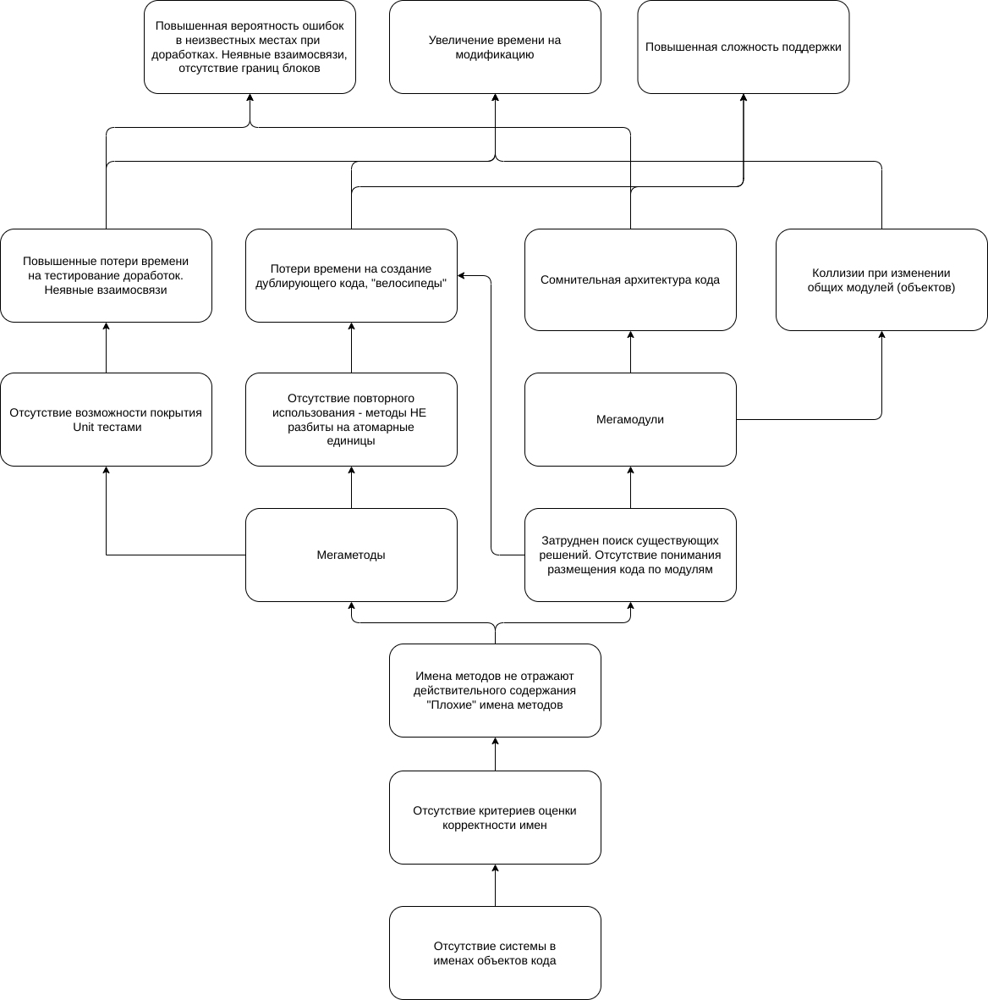
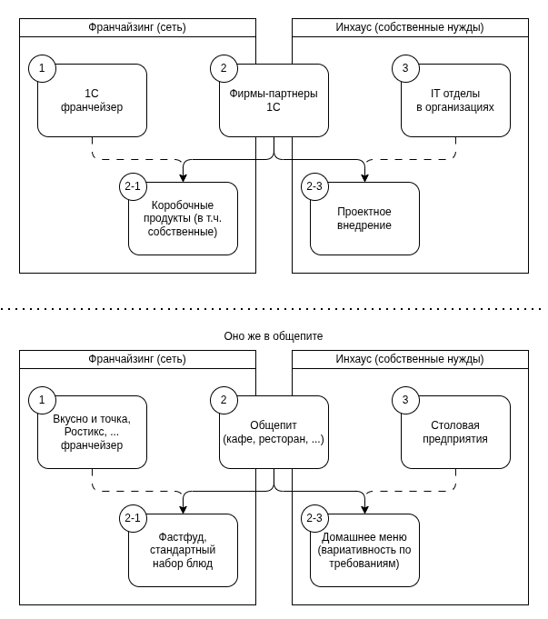

# Объектный стиль имён

[Все статьи](./README.md)

Статья объясняет, зачем [стандарт](../standart/02_names.md#22-объектный-стиль-имён) требует объектный стиль имён, чем он отличается от привычного «разговорного» стиля типовых конфигураций и когда какой стиль выгоднее.

## Суть

> **Большее содержит меньшее и стоит слева. Действие или признак относится к последнему элементу и стоит справа.**

`Машина.Кузов.Багажник.Крышка.Открыть()` — объекты перечислены от большего к меньшему, действие выполняется над самым правым. Это обычная запись в стиле ООП, только в 1С точки между частями убираются: начало имени уходит в префикс подсистемы и имя общего модуля, конец — в имя метода.

Это не критика типового кода. Стиль типовых конфигураций полностью решает задачи фирмы 1С. Вопрос в том, совпадают ли ваши задачи с её задачами. Каждый подход не хорош и не плох сам по себе — его стоит выбирать осознанно, а не потому, что «все так делают».

## Два стиля

**Разговорный** (типовой код). Слова стоят в порядке естественной русской речи: `[Действие | Признак]<Предмет><Его владелец><Владелец владельца>`. Например, `ОткрытьКрышкуБагажникаМашины`.

**Объектный.** Слова упорядочены от большего к меньшему: `[Контейнер]<Объект>[Свойство[Свойство]][Действие | Признак]`. Например, `МашинаБагажникКрышкаОткрыть`.

| Разговорный стиль | Объектный стиль |
|---|---|
| **Переменные** | |
| `НаименованиеРегиона` | `РегионНаименование` |
| `ТаблицаКонтрагентов` | `КонтрагентыТаблица` |
| `СуммаНДСПоСтроке` | `СтрокаНДССумма` |
| **Процедуры** | |
| `НастроитьОтложенныйЗапуск` | `ЗапускОтложенныйНастроить` |
| `ЗаполнитьРеквизитыПоУмолчанию` | `РеквизитыУмолчаниеЗаполнить` |
| `ОтправитьУведомлениеМенеджеру` | `МенеджерУведомлениеОтправить` |
| **Функции** | |
| `ПараметрыДляПроведенияДокумента` | `ДокументПроведениеПараметры` |
| `ПолучитьОсновнойДоговорКонтрагента` | `КонтрагентДоговорОсновной` |
| `ПреобразоватьКлючиСтруктурыВСтроку` | `СтруктураКлючиВСтрока` |

## Наглядная аналогия

Представьте каталог, где файлы названы датами. Если даты записаны «как придётся», их нельзя упорядочить, а если по правилу «год-месяц-день» — они сами раскладываются по порядку.

<table>
<tr><th>Как придётся</th><th>От большего к меньшему</th></tr>
<tr valign="top"><td><pre>
15032022
18032023
19042022
190421
20апреля21
20апреля22
21январь2023
ЧетырнадцатоеМая2021
</pre></td><td><pre>
20210419
20210420
20210514
20220315
20220419
20220420
20230121
20230318
</pre></td></tr>
</table>

Второй список естественно раскладывается в дерево «год → месяц → день». С именами кода то же самое: объектные имена сами группируются по объектам, и по имени сразу понятно, где лежит метод и что ещё относится к этому объекту.

## Какие проблемы решает

Когда имена строятся по правилам разговорной речи, у них нет структуры. Под процессное имя модуля («что происходит») подходит что угодно. Отсюда типичные проблемы:

- **Мегамодули.** Модуль вида `ЗапасыСервер` или `ОбщегоНазначения` собирает всё подряд: проведение, запросы, события, взаимодействие с пользователем. Десятки тысяч строк, в которых трудно ориентироваться; одновременно с модулем может работать только один разработчик.
- **Дубли.** Нужный метод не находят и пишут заново. Со временем появляются несколько реализаций одной логики с разными ошибками, и исправлять приходится в каждой.
- **Смешивание функционала.** Методы делают «всё и сразу», потому что имя не ограничивает их назначение.
- **Неясный контракт.** Методы со словом `Проверить` в имени в одном месте выдают сообщение, в другом возвращают булево значение, в третьем вызывают исключение. Пока не заглянешь внутрь — не угадаешь.
- **Неуправляемые параметры.** В методы передаются структуры, про которые непонятно, какие ключи в них лежат, пока не прочитаешь страницу кода.
- **Магические константы.** Состояние кодируется числами (0 — не настроено, 1 — настроено частично, 2 — настроено), а их смысл объясняют комментарии рядом.



Главная причина — **нет системы в именах**. Её и вводит объектный стиль.

## Постулат и правила

**Постулат.** Любой метод **всегда принадлежит** какому-то объекту. Методов «самих по себе» не бывает: метод управляет свойствами или состоянием объекта либо выполняет над ним действие.

**Правила.**

1. Имя элемента кода всегда однозначно сообщает, что в нём содержится, — и ничего больше.
2. Имя строится как `Объект[.Свойство[.Свойство]][.Метод]`: владельцы слева направо, имя метода — в конце.

**Следствия.**

- Код естественно группируется по объектам-владельцам.
- Появляется однозначный критерий правильности имени — его можно проверить на ревью.
- Подсистемы легко выделить: первый объект обычно и есть подсистема, и его имя уходит в префикс.
- Модули получаются небольшими и однородными, их можно дорабатывать параллельно.

## Пример переработки

Модуль «про всё» с методами в разговорном стиле:

```bsl
ЗаказыСервер.ПолучитьПараметрыПроведенияЗаказа(Заказ, Свойства)
ЗаказыСервер.ТекстЗапросаОстатковДляРезерва(ЗаказМетаданные)
ЗаказыСервер.ОтразитьДвиженияРезерва(Таблицы, Движения, Отказ)
ЗаказыСервер.ПроверитьИзменениеРеквизитовЗаказа(Ссылка, ИменаРеквизитов)
ЗаказыСервер.СообщитьОРезультатахКонтроляРезерва(Результаты, Отказ)
```

Нормализуем имена по правилу «объект → действие» — и группировка по модулям появляется сама:

```bsl
зкз_ПроведениеПараметры.Создать(Заказ, Свойства)
зкз_РезервЗапрос.ОстаткиТекст(ЗаказМетаданные)
зкз_РезервДвижения.Отразить(Таблицы, Движения, Отказ)
зкз_Реквизиты.Изменены(Ссылка, ИменаРеквизитов)
зкз_РезервКонтроль.РезультатСообщить(Результаты, Отказ)
```

Один большой модуль превратился в несколько небольших, у каждого одно назначение. Теперь понятно, куда положить новый метод и где искать существующий.

## Когда какой стиль выгоднее

| | Типовые решения («коробки») | Внутренние продукты и доработки внедрений |
|---|---|---|
| **Функционал** | Много стандартизированных функций для «усреднённой» организации | Максимально закрывает особенности конкретной организации |
| **Авторы** | Фирма 1С и партнёры-разработчики тиражных решений | Собственные ИТ-отделы и партнёры-внедренцы |
| **Цель** | Максимум потребителей | Максимально удобный продукт для одного потребителя |



Для тиражного продукта важна привычность кода для огромного числа партнёров — здесь разговорный стиль оправдан. Для внутреннего продукта и доработок важнее скорость поиска, отсутствие дублей и лёгкость изменений — здесь объектный стиль даёт больше.

Поэтому в стандарте: **переменные, методы и общие модули пишем в объектном стиле, а объекты метаданных (кроме общих модулей) и доработки внутри типового кода называем по правилам 1С** (см. [2.1.9](../standart/02_names.md#21-общие-правила) и [10.1](../standart/10_metadata.md#101-имена-и-представления)).
