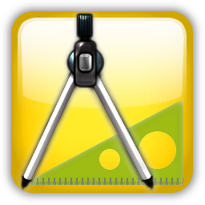

# Стандарты кодирования

Целью документа является разработка единого стиля кодирования и правил общения между разработчиками, позволяющими облегчить понимание исходного кода и уменьшить транзакционные издержки общения между членами команды.  
Следует учесть, что итоговый продукт возможно будет сертифицирован на совместимость с платформой 1С. Поэтому, кроме перечисленных требований, код программы должен соответствовать стандартам, определенным фирмой 1С.

**То, что здесь написано – делаем так, остальное – по стандартам 1С.**

**Цените легкость чтения кода выше, чем удобство его написания.** Даже во время первоначальной разработки программы код приходится читать гораздо чаще, чем писать. Что уж говорить про сопровождение кода.  
Следуем простой логике - код должен быть корректным и читабельным с точки зрения здравого смысла.

> Профессиональные программисты пишут удобочитаемый код. И точка.

**Основные обязательные критерии качества кода, в приоритетах процесса разработки:**

1. Читабельность - Код максимально прост и понятен, даже для программиста не самой высокой квалификации, его легко быстро понять и модифицировать.
2. Простота для доработки - Код написан так, чтобы чтобы при необходимости его можно было масимально быстро доработать или изменить, в том числе другому программисту через несколько месяцев.
3. Правильность исполнения - не падает с ошибками и корректно реализует бизнес-логику.
4. Оптимальность - Код выполняется быстро и не нагружает систему лишними запросами к базе и серверными (контекстными) вызовами. Любые работы по оптимизации, приводящие к усложнению кода и потере читабельности, либо большим трудозатратам должны проводиться ТОЛЬКО при необходимости.

> Практика показывает, что соблюдение первых 2х правил в значительной степени обеспечивает естественное выполнение последних 2х правил

Необходимо помнить, что код пишется не для себя, а для Заказчика и/или коллег и как правило в разработке принимает участи группа специалистов. Как следствие для комфорта дальнейшего контроля/использования/поддержки/модификации все участники разработки должны придерживаться единых правил создания/оформления кода.  
Следует прикладывать усилия чтобы делать свой код максимально читабельным. Если можно сделать код более читабельным, добавив дополнительную переменную или изменив его иным образом, то нужно это сделать.

## Оглавление

*  [1. Вводная. Зачем все это нужно?](./code_standart_01_intro.md)
*  [2. Правило бойскайта](./code_standart_02_boyskite_rule.md)
*  [3. Имена](./code_standart_03_names.md)
*  [4. Методы](./code_standart_04_methods.md)
*  [5. Переменные](./code_standart_05_vars.md)
*  [6. Управляющие конструкции](./code_standart_06_control_structs.md)
*  [7. Запросы](./code_standart_07_queries.md)
*  [8. Объекты метаданных](./code_standart_08_metadata_objects.md)
*  [9. Комментарии и аннотации](./code_standart_09_comments.md)
*  [10. Форматирование](./code_standart_10_decor.md)
*  [11. Модификация типового функционала](./code_standart_11_modyfy_std_conf.md)
*  [12. Расширения](./code_standart_12_extensions.md)
*  [13. Производительность](./code_standart_13_perfomance.md)
*  [14. Стиль работы](./code_standart_14_work_style.md)

---

*Данная статья была написана с использованием различных материалов, книг и личных выводов автора. В том числе обязательно стоит упомянуть книгу Никиты Зайцева (WildHare) "[**Не спеша, эффективно и правильно – путь разработки**](https://infostart.ru/1c/articles/1246946/)". - многие тезисы лучше Никиты автор сформулировать не смог, по этому взял их.*

*Стоит сказать, что статья не завершена, да и не может быть завершена никогда. Она периодически развивается и дополняется наравне со стандартами и технологиями.*

Курилович Андрей, Team Lead, Odyssey Consulting Group, 2024
