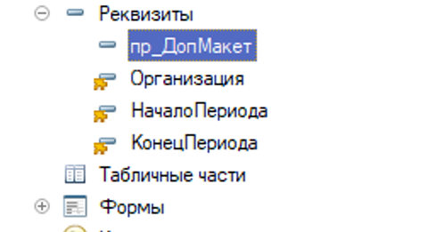

#  3. Имена

[[_TOC_]]

## Правила

### 3.1 Общие принципы имен

* **3.1.1** Наименование должно быть осмысленным и однозначно отражать назначение именуемого объекта. Исключением можно считать только тривиальные переменные вроде счетчика цикла. При необходимости в конце имени объекта приписывается имя типа его содержимого, например `КонтрагентОбъект`, `КонтрагентСсылка`, `ДокументыСписок`, `ЗаписиНабор` ...
* **3.1.2** Наименования не должны содержать орфографических ошибок.
* **3.1.3** Запрещается использовать в именах произвольные сокращения. Например ОприхТовНаГлСкл. Необходимо всегда полное написание слова. Исключение составляют общепринятые аббревиатуры, например ЦФО, SQL.
* **3.1.4** Запрещено в именах использовать частице `Не`
* **3.1.5** Названия всех нетиповых объектов конфигурации (документов, справочников, перечислений и т.п.), модулей, глобальных переменных и глобальных методов должны начинаться с префикса подсистемы, при отсутствии выделенной подсистемы, с префикса <Организация проекта>, плюс знак подчеркивания. Сюда же относятся свойства, помещаемые в коллекцию ДополнительныеСвойства объектов, т.к. они могут пересекаться с "типовыми". Подчеркивание в данном случае применяется для того, чтобы отделить префикс подсистемы от осмысленного имени. В остальных случая использование знака подчеркивания **запрещено**.
* **3.1.6** Имена хранимых в базе данных объектов конфигурации (Справочники, Документы, Регистры, Константы, ...) называем исходя из [рекомендаций вендора](https://its.1c.ru/db/v8std/content/550/hdoc).
* **3.1.7** Для одинаковых по типу (или смыслу) объектов обязательно использовать одинаковые наименования (где это возможно), и ни в коем случае не использовать совпадающие наименования для разных по типу (смыслу) объектов. Это относится к коду в рамках всего проекта, а не только к одному модулю, поэтому перед началом работы над новым модулем обязательно обговорите с коллегами наименования нужных объектов (ведь они уже могли их использовать).
* **3.1.8** Наименование должно начинаться с заглавной буквы. Если в наименовании есть несколько слов, тогда каждое слово должно начинаться с большой - используем стиль [CamelCase](https://ru.wikipedia.org/wiki/CamelCase). Исключением являюся имена доступный извне ресурсов - для них используем устоявшийся для них стиль имен. Например для HTTP это только нижний регистр, стиль [snake](https://ru.wikipedia.org/wiki/Snake_case)
* **3.1.9** Необходимо использовать только русские имена. Исключения из данного правила:
  - Код, связанный с внешними компонентами.
  - Переопределение системных процедур
  - Работа с внешними приложениями и объектами (СОМ, OLE)
  - Web и http сервисы

### 3.2 Методы и переменные

* **3.3.1** Имена методов должны содержать глагол неопределенной формы совершенного вида, отвечающим на вопрос "Что сделать?".
* **3.3.2** Допускается и, для краткости кода, приветствуется опускать в имени функции глагол "Получить", **если имя функции оканчивается** на предмет возвращаемого функцией значения.
* **3.3.3** Функции и переменные, которые предназначены для проверки чего-либо, возвращают в качестве результата проверки булево значение, следует именовать так, как называется результат проверки Истина. В конце имен таких объектов можно поставить знак вопроса и должно получиться осмысленное выражение.
* **3.3.4** Методы форм, выполняемые в контексте **сервера** должны иметь стандартный постфикс `НаСервере`

## Пояснения, рассуждения и рекомендации

### Принцип формирования имен.

> 👉 Можно почитать стандарты ИТС формирования имен [методов](https://its.1c.ru/db/v8std#content:647:hdoc) и [переменных](https://its.1c.ru/db/v8std/content/454/hdoc), **не забывая**, что используем ООП подход именования объектов.

Важнейший принцип именования переменных состоит в том, что **имя должно полно и точно описывать сущность**, представляемую переменной. Один эффективный способ выбора хорошего имени предполагает формулирование сути переменной в словах. Оптимальным именем переменной часто оказывается само это высказывание. Благодаря отсутствию загадочных сокращений оно удобочитаемо, к тому же оно однозначно. Так как оно является полным описанием сущности, его нельзя спутать с чем либо другим. Наконец, такое имя легко запомнить, потому что оно похоже на исходную концепцию.

*Неудачный пример имени:*



**Не нужно бояться переименовывать переменные, если вы придумали имя получше.** Полезно не только исходно выбирать **ясные имена**, но и заменять названия на более удачные, если они нашлись позже. 1С позволяет легко заменить название переменной во всём коде, так что это не должно быть проблемой.

**Размер имеет значение.**. Имя не должно быть огромным, но может быть и небольшим. Чем меньше значимость переменной - тем короче её имя. Не стоит использовать однобуквенные имена, однако для  счетчиков цикла или подобных им малозначимым переменным можно давать короткие имена. Краткость в имени говорит об малозначительности переменной, а так же её использовании только в локальной части кода. Слишком длинные имена так же не желательны, т.к. сильно тянут на себя внимание и не дают себя прочитать бегло, с наскока.

**Ваш код будут читать программисты**.

Не стесняйтесь использовать термины из области информатики, общепринятые названия алгоритмов и паттернов. Такие имена сообщают информацию быстрее, чем сам код.

**Использование Аббревиатур**.

Вполне допускается использовать общепринятые аббревиатуры, известные большинству людей. Например РФ, КПД, ООО и прочие. Они делают код компактнее, и как следствие более читаемым.

Однако малоизвестные аббревиатуры использовать как раз не стоит, желательно расшифровывать их понятными словами. Наш мозг так устроен, что попытается расшифровать непонятную ему аббревиатуру, тем самым мы не сократим время чтения кода, а наоборот, увеличим его.

### Дезинформация

**Имена должны передавать намерения программиста.**

К выбору имен следует относиться серьезно. Чтобы выбрать хорошее имя, понадобится время, но экономия окупит затраты. Итак, следите за именами в своих программах и изменяйте их, если найдете более удачные варианты. Этим вы упростите жизнь каждому, кто читает ваш код (в том числе и себе самому).
Имя переменной, метода, объекта метаданных должно отвечать на все главные вопросы. Оно должно сообщить, почему эта переменная (и т. д.) существует, что она делает и как используется. **Если имя требует дополнительных комментариев, значит, оно не передает намерений программиста.**

Программисты должны избегать ложных ассоциаций, затемняющих смысл кода.
Не используйте слова со скрытыми значениями, отличными от предполагаемого. 

При грамотно выбранных именах переменных можно легко понять, что происходит в коде. Такова сила выбора хороших имен.

Дезинформация в именах встречается часто и вредит чтению кода. Частой ошибкой является описание типа переменной в её имени, например "МассивСсылок", когда в реальности в этой переменной хранится иной тип.

> 🧐 Согласно гипотезе Сапира Уорфа способность человека к обдумыванию определенных мыслей зависит от знания слов, при помощи которых можно выразить эту мысль. Если вы не знаете слов, то не сможете выразить мысль и, возможно, даже сформулировать ее (Whorf, 1956).

### Малозаметные различия в именах

**Остерегайтесь малозаметных различий в именах**  
```bsl
// Опасный код, написанный в "стандартном стиле"
Для Каждого СтрокаТаблицыДисконтныеКартыПокупателей Из СтрокиТаблицыДисконтныеКартыПокупателей Цикл
    СтрокаТаблицыДисконтныеКартыПокупателей.Ссылка = Объект.Ссылка;
    СтрокаТаблицыДисконтныеКартыПокупателей.Наценка = Наценка;
    СтрокаТаблицыДисконтныеКартыПокупателей.ПроцентСкидки = ПроцентСкидкиРозничнойЦеныСоСкидкой(Наценка);
КонецЦикла;
```

Эти имена выглядят устрашающе похожими. Имена такого рода это так же своего рода дезинформация.

```bsl
// Безопасный код, написанный в стиле ООП имен
Для Каждого ПокупателиДисконтныеКартыТаблицаСтрока Из ПокупателиДисконтныеКартыТаблица Цикл
    ПокупателиДисконтныеКартыТаблицаСтрока.Ссылка = Объект.Ссылка;
    ПокупателиДисконтныеКартыТаблицаСтрока.Наценка = Наценка;
    ПокупателиДисконтныеКартыТаблицаСтрока.ПроцентСкидки = ПроцентСкидкиРозничнойЦеныСоСкидкой(Наценка);
КонецЦикла;
```

1С поддерживает удобный механизм автоматического завершения кода. Вы вводите несколько символов имени, нажимаете "Пробел" и получаете список возможных вариантов завершения имени. Имена похожих объектов сортируются по алфавиту, и если различия
не очевидны разработчик, возможно, ошибется.

Простое переименование решает проблему.

> ⚠️ Остерегайтесь малозаметных различий – имена объектов должны существенно отличаться друг от друга. По этой причине плохи длинные имена с повторяющимся элементами – чтобы сличить их друг с другом, тратятся лишние силы и время.

### Осмысленные различия

**Используйте осмысленные различия**.

Когда программист пишет код исключительно для того, чтобы удовлетворить запросы компилятора или интерпретатора, он сам себе создает проблемы. 

«Числовые ряды» вида (Перем1, Перем2, .. ПеремN) являются противоположностью сознательного присваивания имен. Такие имена не дезинформируют — они просто не несут информации и не дают представления о намерениях автора.

**Избегайте ложных ассоциаций**.

Путаница возникает, если несколько синонимичных слов и выражений используются для обозначениях разных сущностей, например, ДокументСчет. Это может быть ДокументСсылка, ДокументОбъект и т.д.

**Бессодержательные различия**.

Неинформативные слова также применяются для создания бессодержательных различий. 

Допустим, у вас имеется структура ИнформацияПоТовару. Создав другую структуру
СведенияОТоваре или ДанныеОТоваре, вы создаете разные имена, которые по сути обозначают одно и то же.

**Неинформативные слова избыточны.**

Слово "Переменная", как правило, не должно встречаться в именах переменных. Слово "Таблица" как правило не должно встречаться в именах таблиц (или нет?). Слово "Отчет" как правило не должно быть в наименовании отчета. И так далее. Если вы можете убрать какое либо слово из названия и смысл не поменяется - возможно это слово там находится зря.

Еще пример: чем имя НаименованиеСтрокой лучше Наименование? Разве наименование может быть, скажем, числом? Если может, то это нарушает предыдущее правило о дезинформации.

### Легко произносимые имена

**Сокращения**.

Используйте для названий слова. Если названия состоят из сокращений, каждый начинает произносить их по-своему, что затрудняет взаимопонимание. А при чтении кода каждый раз «спотыкаешься» о такое название. **Все равно наш мозг устроен так, что пытается расшифровать сокращенное название, так зачем все усложнять?**

**Удобопроизносимые слова**.

Значительная часть нашего мозга специализируется на концепции слов, а слова по определению удобопроизносимы. Было бы досадно не использовать ту изрядную часть мозга, которая развивалась для разговорной речи. Следовательно, имена должны нормально произноситься.

Если имя невозможно нормально произнести, то при любом его упоминании в обсуждении вы выглядите некрасиво. Наш мозг устроен так, что сложно произносимые слова он старается заменить на более простые, и при общении с другими вы либо исковеркаете слово, либо назовете его не так.

### Короткие имена переменных

**Длина имени.**

Оптимальная длина имени, наверное, лежит где то между длинами имен "`К`" и "`СамаяДлиннаяПеременнаяКоторояПриходитВГоловуАвторуСтатьи`".

- Слишком короткие страдают от недостатка смысла.
- Слишком длинные имена надоедает печатать, к тому же они могут сделать неясной визуальную структуру программы.
- Проблема с именами вроде `файл1` и `файл2` в том, что, даже узнав, что такое `файл1`, вы ничего не сможете сказать об отношении между `файл1` и `файл2`.

**Однобуквенные имена**.

**Однобуквенные имена** желательно использовать **только для локальных переменных в коротких методах**. Длина имени должна соответствовать размеру его области видимости. Если переменная может встречаться или использоваться в нескольких отдаленных друг от друга местах, очень важно присвоить ей имя, удобное для понимания.

**Слишком короткие имена** трудно искать в большом объеме текста. Однобуквенные имена можно использовать только для локальных переменных в коротких методах и счетчиков циклов (н, м, к). Обычно называя объект одной буквой, вы всего лишь создаете временный заменитель. Но не бывает ничего более постоянного, чем что-то «временное». Проверяйте грамотность написания выбранных слов.

В примере переменная "м" несет значимый смысл, она является индексом для поиска по массиву строк. Стоило бы ей дать более осмысленное наименование.

### Префиксы

**Имена должны быть достаточно компактными, чтобы вы могли обходиться без префиксов.**

Префиксы подобные "м_", которыми когда-то снабжались имена, стали ненужными. **Переменные должны быть названы логично и емко, префиксы для этого не нужны**.

Наше восприятие при чтении имени с префиксом всё равно откидывает префикс и запоминает суть переменной. Префикс тут и так лишний.

Так же префиксы могу ввести в заблуждение.

Например: "м_ЦеныТоваров"

Что обозначает префикс "м_"? Мы тратим слишком много времени на то, что бы додумать что же автор вкладывал в смысл префикса. Возможно это массив. Точно?

> ⚠️ Префиксы, столь распространенные в старом коде, в лучшем случае отвлекает, а в худшем передает лишнюю информацию.

**Не стоит использовать нижнее подчеркивание вначале имени.**

Если у вас уже есть переменная с именем, которым вы хотите назвать свою - задумайтесь, возможно имя выбрано необдуманно и нижнее подчеркивание вам не помощник! *Пример* сложно читаемого кода:

```bsl
_датаИзмененияКомпании = Формат((ТекущаяДата() - Дата("19700101")), "ЧГ=0");

_структ1 = Новый Структура;
_структ2 = Новый Структура;
_структ3 = Новый Структура;

_допПоля = Новый Массив;
_допМассив1 = Новый Массив;
_соответствие11 = Новый Структура;
_соответствие12 = Новый Структура;

_соответствие11.Вставить("value", Контрагент.ИНН);
_допМассив1.Добавить(_соответствие11);
_соответствие12.Вставить("id", 552039);
_соответствие12.Вставить("values", _допМассив1);
_допПоля.Добавить(_соответствие12);

_массивГлавный = Новый Массив;
_структураДляJS = Новый Структура;
_структураДляJS.Вставить("request_id", 0);
_структураДляJS.Вставить("id", ИдентификаторАМС);
_структураДляJS.Вставить("name", контрагент.Наименование);
_структураДляJS.Вставить("last_modified", _датаИзмененияКомпании);
_структураДляJS.Вставить("type", "company");
_структураДляJS.Вставить("custom_fields", _допПоля);

_массивГлавный.Добавить(_структураДляJS);
_структ3.Вставить("update", _массивГлавный);
_структ2.Вставить("companies", _структ3);
_структ1.Вставить("request", _структ2);

_записьjs = Новый ЗаписьJSON;
_записьjs.ПроверятьСтруктуру = Ложь;
парЗаписи = Новый ПараметрыЗаписиJSON( , Символы.Таб);
_записьjs.УстановитьСтроку(парЗаписи);
ЗаписатьJSON(_записьjs, _структ1);
СтрокаJSON = _записьjs.Закрыть();
```

**Использование префиксов обязательно при наличии механизма расширений.**

Цели использования префиксов в именах методов, реквизитов, объектов и т.д.  
* Не дать возможности дублировать имена основной конфигурации. Удобочитаемость кода тут ни причем и вынуждена страдать из-за такого ограничения.
* Выделить префиксом обособленный функциональный блок - подсистему/библиотеку

### Остроумие и каламбуры

**Избегайте остроумия. Воздержитесь от каламбуров**.

Старайтесь не использовать **одно слово в двух смыслах**. В сущности, обозначение двух разных идей одним термином — это каламбур.

Задача автора — **сделать** свой **код** как можно более **понятным**. Код должен восприниматься с первого взгляда, не требуя тщательного изучения. Ориентируйтесь на модель популярной литературы, в которой сам автор должен доступно выразить свои мысли, а не на академическую модель, в которой ученик усердным трудом постигает скрытый смысл публикации.

**Шутки** имеют свойство быть понятными лишь ограниченное время и для конкретной аудитории, знакомой с первоисточником. Отдавайте предпочтение ясности перед развлекательностью. Шутки можно приберечь для презентации, которая происходит «здесь и сейчас». Хороший код способен выйти далеко за границы вашей культуры.

### «Волшебные числа»

Волшебные числа — это обычные числа, такие как 100 или 47524, которые появляются в программе без объяснений и сходу нельзя сказать, что они означают.

В общем случае присутствие «сырых» чисел в коде нежелательно. Числа следует скрыть в переменных с содержательными именами.

Например, вместо числа 86400 в теле кода приятнее встретить константу СекундВДне. Однако не стоит следовать этому правилу, как и любому другому, безоговорочно. В формулах некоторые константы лучше воспринимаются в числовой записи.

**Допустимые числа без именования**.

Применяйте жестко заданные нули и единицы по необходимости. Значения 0 и 1 используются для инкремента, декремента, а также в начале циклов при нумерации первого элемента массива. 0 в конструкции:

```bsl
Для н = 0 по Товары.Количество() Цикл
```

вполне приемлем, так же как 1 в выражении:

```bsl
ЗатратыИтого = Итого + 1;
```

Вот хорошее правило: используйте в программе как константы только 0 и 1, а любые другие числа определите как литералы с понятными именами.

```bsl
Для Индекс = 0 По Товары.Количество() Цикл
```

### Избыточный контекст имен

**Не добавляйте избыточный контекст**.

Короткие имена обычно лучше длинных, если только их смысл понятен читателю кода.

Не включайте в имя больше контекста, чем необходимо. Если смысл имени не теряется при исключении части названия - эта часть избыточна.

Определить наличие избыточного контекста проще простого: попробуйте убрать из имени любую его часть - если смысл не изменился - эта часть лишняя.
