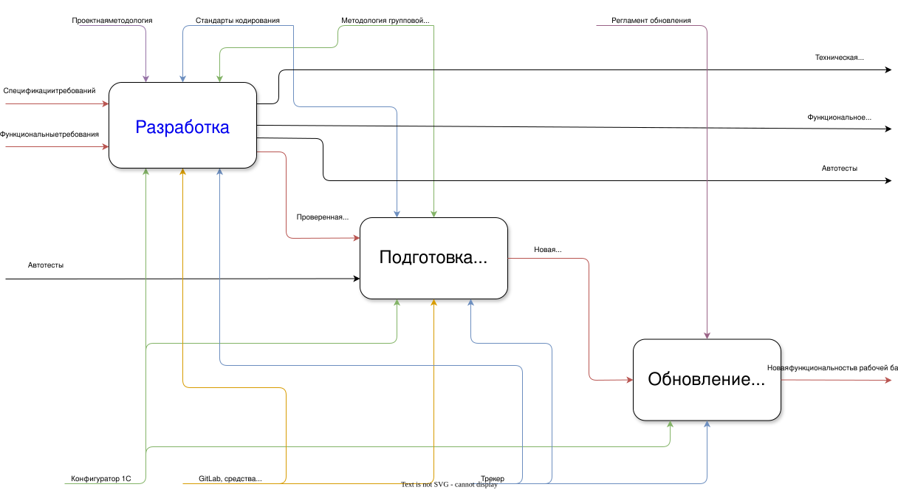

# Процесс разработки

[↑ Инструкции](./README.md)

> Как задача проходит путь от требований до релиза.

## Общий процесс

## Этап «Разработка» подробно

Как вести разработку внутри этапа — от сбора требований до ревью — описано в статье [Правила разработки](../articles/dev_rules.md).
