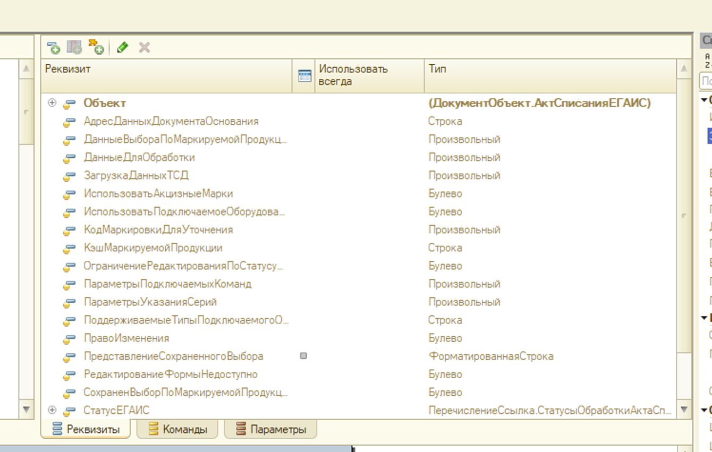
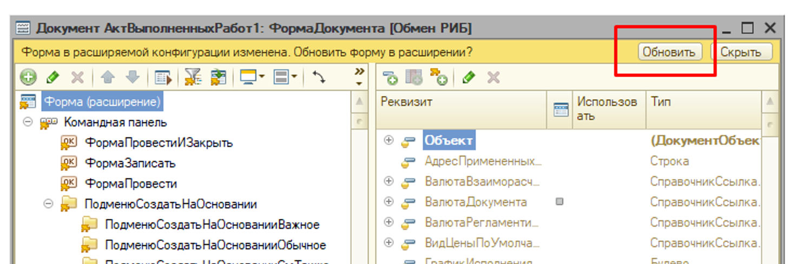

# 14. Расширения

[Оглавление](./README.md) | Назад: [13. Изменение типовой конфигурации](./13_typical_changes.md) | Далее: [15. Производительность](./15_performance.md)

## Правила

### 14.1 Состав расширений

- **14.1.1** Проектное расширение оформляется отдельной подсистемой в рамках БСП. Версии и обновление расширения ведутся [стандартным механизмом обновления БСП](https://its.1c.ru/db/v8std/content/690/hdoc) или [библиотекой обновления компонент](https://gitlab.com/bsl-libs/update_components_ext).
- **14.1.2** Расширение, изменяющее типовой функционал, содержит явный перечень изменений (в описании расширения или во внешней документации).
- **14.1.3** В идеале расширение одно. Если их несколько, у каждого своё чётко обозначенное назначение, и их изменения не пересекаются. Расширения с похожими или ничего не говорящими именами (`Расширение1`, `ОбщиеДоработки`) запрещены.
- **14.1.4** Если объект можно изменить расширением, он изменяется расширением, а не снятием конфигурации с поддержки. Исключение — новые хранимые данные (объекты и реквизиты): они добавляются в конфигурацию (правило [13.1.4](./13_typical_changes.md#131-общие-правила)).

### 14.2 Заимствование

- **14.2.1** Заимствуются только те объекты, которые расширение действительно изменяет: модуль, форму, состав или свойства. Ни больше, ни меньше. Чтобы обратиться к объекту конфигурации из кода расширения (`Справочники.Склады`, `Перечисления.…`), заимствовать его не нужно.
- **14.2.2** В свойствах расширения отключается опция «Поддерживать соответствие объектам расширяемой конфигурации по внутренним идентификаторам».

### 14.3 Методы

- **14.3.1** Способ изменения выбирается в порядке предпочтения:
  1. подписка на событие — для изменения поведения при событиях объектов;
  2. `&Перед` и `&После` — для дополнения метода;
  3. `&ИзменениеИКонтроль` — когда первые два способа не подходят;
  4. `&Вместо` — только с вызовом `ПродолжитьВызов()`.
- **14.3.2** `&Вместо` без `ПродолжитьВызов()` запрещено.
- **14.3.3** Имя метода расширения начинается с префикса расширения.
- **14.3.4** У метода расширения, который перехватывает типовой метод или обработчик, есть описание в одну-две строки: **что и зачем** меняется. Параметры не описываются: они совпадают с параметрами типового метода, проверка их описания отключается комментарием `BSLLS:MissingParameterDescription-off`.

<details><summary>Примеры к 14.3</summary>

`&После` — дополнение типового метода:

```bsl
// Дополняет типовое заполнение: склад по умолчанию из настроек пользователя.
//
// BSLLS:MissingParameterDescription-off - см. синтакс-помощник
&После("ОбработкаЗаполнения")
Процедура пр_ОбработкаЗаполнения(ДанныеЗаполнения, ТекстЗаполнения, СтандартнаяОбработка)

	пр_ЗаказКлиента.СкладПоУмолчаниюЗаполнить(ЭтотОбъект);

КонецПроцедуры
// BSLLS:MissingParameterDescription-on
```

`&Вместо` — только с продолжением вызова:

```bsl
// ❌ Плохо: логика типового метода «заморожена» — изменения вендора в нём не заработают
&Вместо("ЦенаРассчитать")
Функция пр_ЦенаРассчитать(Номенклатура, Дата)

	Результат = пр_Цена.ПоСоглашению(Номенклатура, Дата);

	Возврат Результат;

КонецФункции

// ✅ Хорошо: типовой расчёт выполняется, расширение корректирует результат

// Применяет к типовой цене скидку по соглашению с клиентом.
//
// BSLLS:MissingParameterDescription-off - см. типовой метод
&Вместо("ЦенаРассчитать")
Функция пр_ЦенаРассчитать(Номенклатура, Дата)

	Результат = ПродолжитьВызов(Номенклатура, Дата);
	Результат = пр_Цена.СкидкаПрименить(Результат, Номенклатура, Дата);

	Возврат Результат;

КонецФункции
// BSLLS:MissingParameterDescription-on
```

> Изменить возвращаемое значение типовой функции через `&После` нельзя, поэтому здесь используется `&Вместо` с `ПродолжитьВызов()`.

`&ИзменениеИКонтроль` — когда нужно изменить середину метода:

```bsl
// Добавляет к типовой проверке склада проверку активности склада.
//
// BSLLS:MissingParameterDescription-off - см. типовой метод
&ИзменениеИКонтроль("СкладПроверить")
Процедура пр_СкладПроверить(Отказ)

	Если НЕ ЗначениеЗаполнено(Склад) Тогда
		Отказ = Истина;
	КонецЕсли;
	#Вставка
	// #4550 Склад должен быть активным
	Если НЕ Отказ И НЕ пр_Склад.Активен(Склад) Тогда
		Отказ = Истина;
	КонецЕсли;
	#КонецВставки

КонецПроцедуры
// BSLLS:MissingParameterDescription-on
```

</details>

### 14.4 Формы

- **14.4.1** Заимствованная форма остаётся пустой: в неё не заимствуются реквизиты и элементы и не добавляются новые в редакторе формы.
- **14.4.2** Все изменения формы — реквизиты, элементы, команды, кнопки — делаются программно в модуле формы расширения.
- **14.4.3** Первичное заимствование форм выполняется в пустой конфигурации «болванок», как описано в статье [Модификация форм расширениями](../articles/modify_forms.md).

<details><summary>Пример к 14.4</summary>

```bsl
// Добавляет на форму элементы расширения.
//
// BSLLS:MissingParameterDescription-off - см. синтакс-помощник
&НаСервере
&После("ПриСозданииНаСервере")
Процедура пр_ПриСозданииНаСервере(Отказ, СтандартнаяОбработка)

	пр_ЗаказКлиентаФорма.ЭлементыДобавить(ЭтотОбъект);

КонецПроцедуры
// BSLLS:MissingParameterDescription-on
```

```bsl
// Общий модуль пр_ЗаказКлиентаФорма (сервер)

// Добавляет на форму заказа реквизит и поле «Приоритет отгрузки».
//
// Параметры:
//	Форма - ФормаКлиентскогоПриложения - форма документа «Заказ клиента».
//
Процедура ЭлементыДобавить(Форма) Экспорт

	РеквизитыНовые = Новый Массив;
	РеквизитыНовые.Добавить(Новый РеквизитФормы("пр_ПриоритетОтгрузки",
		Новый ОписаниеТипов("ПеречислениеСсылка.пр_ПриоритетыОтгрузки")));
	Форма.ИзменитьРеквизиты(РеквизитыНовые);

	Родитель = Форма.Элементы.Найти("ГруппаДоставка");
	Поле = Форма.Элементы.Добавить("пр_ПриоритетОтгрузки", Тип("ПолеФормы"), Родитель);
	Поле.Вид = ВидПоляФормы.ПолеВвода;
	Поле.ПутьКДанным = "пр_ПриоритетОтгрузки";

КонецПроцедуры
```

</details>

## Пояснения и рекомендации

### Зачем расширения

Главное преимущество расширений — объекты основной конфигурации остаются на поддержке. Обновление часто выполняет не самый опытный специалист, и наша задача — избавить его от проблем:

- доработки, потерянные при обновлении по невнимательности;
- сложное сравнение и объединение модуля из-за мелкой правки;
- часы, а то и дни сравнения конфигурации поставщика с текущей.

Технология расширений активно развивается, и с каждой версией платформы в расширении можно изменить всё больше.

### Заимствуем только нужное

Когда свойства заимствованного объекта меняются в основной конфигурации, расширение не подключится и покажет ошибку. Это полезно: проблема обнаружится сразу, а не будет незаметно накапливаться. Иногда ошибка возникает из-за изменений, которые на доработку не влияют. Это побочный эффект, и с ним можно жить. А если в расширении есть заимствованный объект, который не используется, — зачем он там?

### Сколько расширений

Чем больше расширений, тем выше шанс, что несколько из них меняют один объект. Найти все изменения объекта становится сложно, а когда они найдены, выясняется, что есть ещё. Цель — чтобы место для доработки находилось быстро и однозначно.

### Почему формы — только программно

Если в заимствованной форме нет заимствованных реквизитов и элементов, её структура не «замораживается»: после обновления основной конфигурации форма перестраивается сама, а наши элементы добавляются кодом.

| Реквизиты формы не заимствованы | Элементы перестраиваются при обновлении |
|---|---|
|  |  |

Худшее, что может случиться при таком подходе, — в основной конфигурации исчезнет элемент-родитель или элемент, перед которым мы вставляем свой. Первый же дымовой тест это покажет, и исправление займёт минуты. Это несравнимо дешевле потерянных доработок после перестроения формы.

Кроме того, при объединении структур форм, особенно когда форму меняют несколько расширений, возникают «плавающие» ошибки платформы. Пустые заимствованные формы их исключают. Минус — разработка дольше, чем «накликать» элементы мышкой.

### `&Вместо` — бомба с таймером

`&Вместо` без `ПродолжитьВызов()` замораживает логику типового метода. Когда вендор изменит эту логику в обновлении, никто не узнает: метод просто продолжит работать по-старому. Возможно, ошибку увидят сразу после обновления. А возможно, о ней сообщит налоговая, получив отчётность, которая немного отличается от реальности.

С `ПродолжитьВызов()` аннотация безопасна. `&Перед` и `&После` ещё лучше: по ним сразу видно, что типовой метод выполняется всегда и только дополняется, и заглядывать внутрь не нужно.

---

[Оглавление](./README.md) | Назад: [13. Изменение типовой конфигурации](./13_typical_changes.md) | Далее: [15. Производительность](./15_performance.md)
